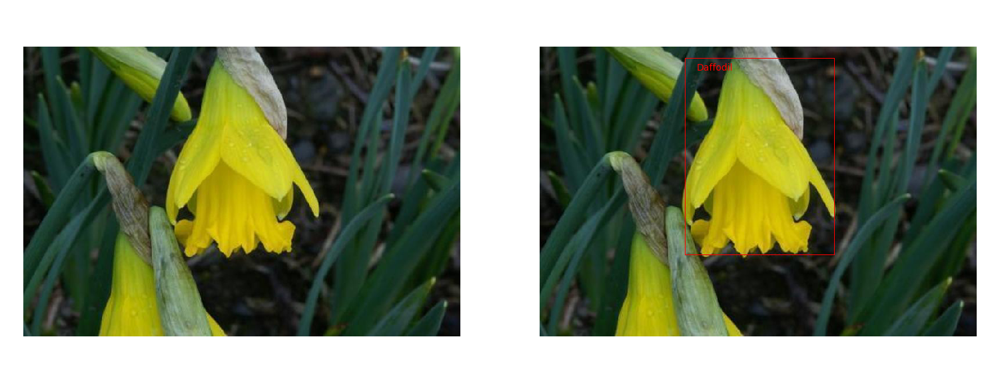

# a pytorch vision of R-CNN
---
An implementation of R-CNN using pytorch on 17flowers

## Content
1. requirements
2. training model
3. test

### Requirments
To clone this program, run
```
git clone https://github.com/zsy0016/R-CNN-pytorch.git
```

To install required python packages, run
```
pip install -r requirements
```
To prepare required 17flowers dataset, run
```
./data/17flowers.sh
```

### Training model
1. Run `python create_regions.py` to do selective search to generate region proposals. Raw R-CNN proposes ~2000 regions for each image. Here, only ~200 regions are used for limited calculation capacity.
2. Run `python train.py --rank rank --local_rank local_rank` to train model on multi GPUs. Default model is pretrained alexnet, use optional `--cnn vgg` to use vgg architecture.
3. Raw R-CNN uses bounding box regression to reduce localization errors. Here, this process is omited.

### Test model
Run `python test.py` to test images



## Note
Herein, intersected area / region area > 0.5 is taked as the condition of being positive sample and intersected area / region area < 0.1 as the negative rather than IoU because of the less proposed regions.  
The category containing most regions are considered as the category of that image.   
When doing NMS, only the first region is picked and plotted in test. 
